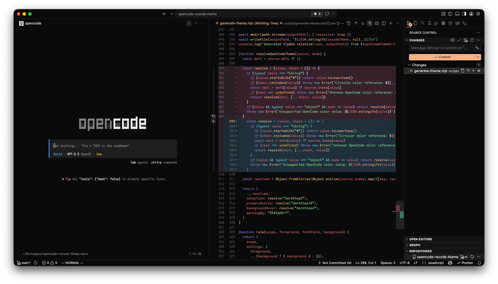
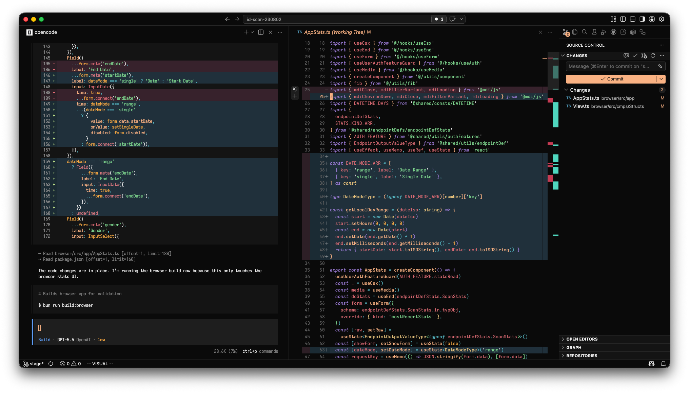

# OpenCode Theme for VS Code

[](https://marketplace.visualstudio.com/items?itemName=jackrobertscott.opencode-vscode-theme)
[](https://marketplace.visualstudio.com/items?itemName=jackrobertscott.opencode-vscode-theme)
[](LICENSE)

An unofficial VS Code theme inspired by OpenCode's default dark interface: near-black surfaces, warm peach accents, purple keywords, cyan operators and properties, green strings, yellow types, and red variables/errors.

Designed for developers who like OpenCode's terminal-first visual language and want the same calm, high-contrast palette across the VS Code editor, sidebar, terminal, panels, quick picker, Git views, and syntax tokens.

## Preview





## Features

- OpenCode-inspired dark UI using a near-black foundation with peach, purple, cyan, green, yellow, and red accents.
- Complete workbench coverage for the activity bar, sidebar, tabs, editor groups, panel, status bar, menus, quick input, notifications, and terminal.
- Syntax highlighting tuned for TypeScript, JavaScript, JSON, CSS, Markdown, Python, Rust, and other common grammars.
- Semantic token support for modern language servers, including classes, functions, methods, parameters, properties, decorators, and enum members.
- Diff, merge, Git decoration, overview ruler, and minimap colors tuned to remain readable without overpowering the editor.
- Terminal colors mapped to the same palette so command-line work feels consistent with the rest of the UI.

## Best For

- Developers who use OpenCode and want a matching VS Code theme.
- Dark-theme users who prefer low-glare backgrounds with warm highlights.
- Projects with heavy Git, diff, markdown, TypeScript, JavaScript, or terminal workflows.

## Palette

| Role | Color |
| --- | --- |
| Background | `#0a0a0a` |
| Panel | `#141414` |
| Text | `#eeeeee` |
| Primary | `#fab283` |
| Accent | `#9d7cd8` |
| Info | `#56b6c2` |
| Success | `#7fd88f` |
| Warning | `#f5a742` |
| Error | `#e06c75` |

## Installation

Install from the [Visual Studio Marketplace](https://marketplace.visualstudio.com/items?itemName=jackrobertscott.opencode-vscode-theme), then select `OpenCode` from `Preferences: Color Theme`.

You can also install a packaged `.vsix` build from this repository with `Extensions: Install from VSIX...`.

## Development

Theme colors are generated from `scripts/generate-theme.mjs` into `themes/opencode-color-theme.json`.

```sh
npm run generate
npm run package
```

## Notes

This project is an unofficial community theme. It is not affiliated with or endorsed by OpenCode.
